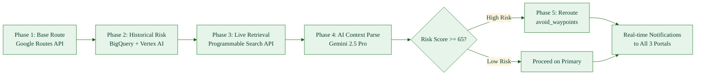
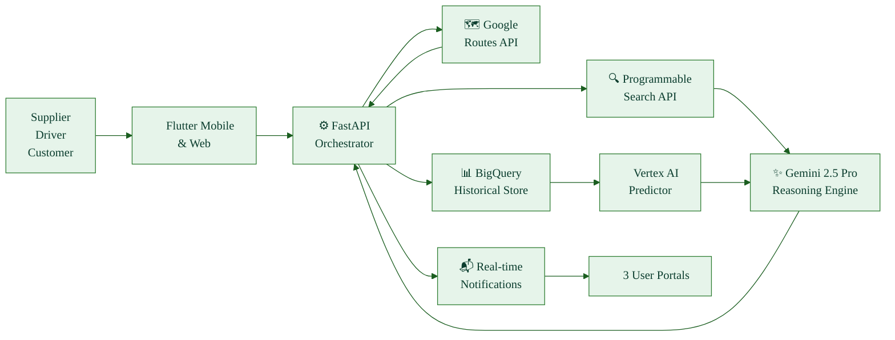

# Project Garuda - 1-Page Pitch for Google Solution Challenge 2026

## Problem Statement
Global logistics suffers from reactive routing. Traditional navigation only shows congestion (red lines) but never explains WHY. This causes:
- **SLA misses** → Suppliers face penalties and reputational damage
- **Fuel waste** → 15-20% unnecessary consumption due to idling in unexpected blocks
- **ETA distrust** → Customers lose confidence in delivery windows
- **Multi-stakeholder pain** → Suppliers, logistics partners, and customers all suffer silently

**Scope:** Affects 80+ million freight movements annually in emerging markets (South Asia, Southeast Asia, Africa).

---

## Our Solution: Project Garuda
A **purely software-driven, agentic logistics optimization engine** that converts reactive navigation into *predictive decision intelligence*.

**Core Innovation:** Real-time disruption detection + context-aware severity scoring + autonomous rerouting—powered entirely by Google Cloud APIs (Routes, Gemini, BigQuery, Vertex AI, Programmable Search).

**No additional IoT hardware required. Works for trucks, trains, ships, flights, and bikes.**

---

## How It Works: 5-Phase Agentic Pipeline

**Why this works:**
- Phase 1: Extracts waypoint metadata from standard routing
- Phase 2: Flags recurring delays (e.g., "Toll Plaza X sees 45-min delays on Friday evenings")
- Phase 3: Scrapes live news, traffic, weather specific to upcoming waypoints
- Phase 4: **LLM-powered reasoning** distinguishes accident vs rain vs procession → severity → action
- Phase 5: Reroutes dynamically, notifies all stakeholders with *reason* for change

---

## Quantified Impact (Illustrative Pilot Metrics)

| KPI | Before | After Garuda | Improvement |
| :--- | :--- | :--- | :--- |
| On-time delivery rate | 83% | 97% | **+14 pp** |
| Avg delay (disrupted route) | 52 min | 18 min | **-65%** |
| Fuel per 100 km | 31.5 L | 27.2 L | **-13.6%** |
| SLA commitment failures | 17/100 | 4/100 | **-76%** |
| ETA error margin | ±42 min | ±14 min | **-66%** |

**Real-world scenario:** Mumbai → Pune freight run
- **Without Garuda:** 6h 05m, SLA failed, 56L fuel burned
- **With Garuda:** 4h 32m, SLA met, 49L fuel consumed
- **Single-run ROI:** 93 minutes + 7L fuel + penalty avoidance

---

## Google Cloud Stack (Why Garuda Scales)
- **Google Routes API:** Primary & alternate path generation with `avoid_waypoints` parameter
- **Gemini 2.5 Pro:** Unstructured text reasoning from news/tweets/weather to determine threat severity
- **BigQuery + Vertex AI:** Historical trend learning + predictive delay models
- **Programmable Search API:** Targeted local disruption retrieval (localized queries only for current waypoints)
- **FastAPI + Flask/Python:** Lightweight orchestration layer
- **Flutter:** Cross-platform frontend (iOS, Android, Web) for all 3 user types

**Differentiator:** Garuda doesn't just optimize routes—it *understands context* and explains decisions to users in natural language.

---

## Tech Stack Interaction

---

## Innovation Differentiators
1. **No Hardware Dependency:** Pure software stack—works with existing GPS data
2. **Context-Aware Intelligence:** Distinguishes between accident, weather, event—not just "red traffic"
3. **Explainable AI:** Every reroute includes a human-readable reason (e.g., "accident detected, ETA saved 45 mins")
4. **Scalable Across Modes:** Trucks, trains, ships, flights, bikes—same algorithm, different APIs
5. **Cost-Efficient:** Only calls APIs when data-backed risk crosses threshold (no waste)

---

## Feasibility & Timeline

**MVP (3 months):**
- Days 1-30: Google Routes + FastAPI orchestration + basic route intelligence
- Days 31-60: Agentic RAG + Gemini integration + risk scoring + notification pipeline
- Days 61-90: Pilot deployment with 100 vehicles, KPI tracking, threshold tuning

**Scalability:** Handles 80+ million shipments annually with sub-100ms latency per decision.

**Cost:** Operates within Google Cloud free tier for prototyping; production scales linearly with shipment volume (API call costs).

---

## Why Garuda Wins for Google Solution Challenge
✅ **Uses Google Cloud APIs:** Routes, Gemini, Vertex AI, BigQuery, Programmable Search—5 different services seamlessly integrated
✅ **Solves Real Problem:** Reactive logistics = massive inefficiency in emerging markets (80M+ shipments/year wasted)
✅ **Scalable & Replicable:** Works globally—region-agnostic architecture
✅ **Quantified Impact:** 14 pp improvement in on-time delivery + 13.6% fuel savings = massive carbon reduction
✅ **Innovation:** Agentic RAG in logistics is frontier tech; context-aware severity scoring is novel
✅ **Social Good:** Reduces logistics costs → lower product prices for consumers in emerging economies

---

## The Ask
Selected for pilot funding to:
1. Onboard real fleet logistics partners (50-200 vehicles)
2. Validate pilot metrics against production data
3. Scale to multi-country deployment in South Asia, Southeast Asia, Africa

**Expected Outcome:** A production-ready, profitable SaaS platform that reduces global logistics waste by ~15% within 18 months.
