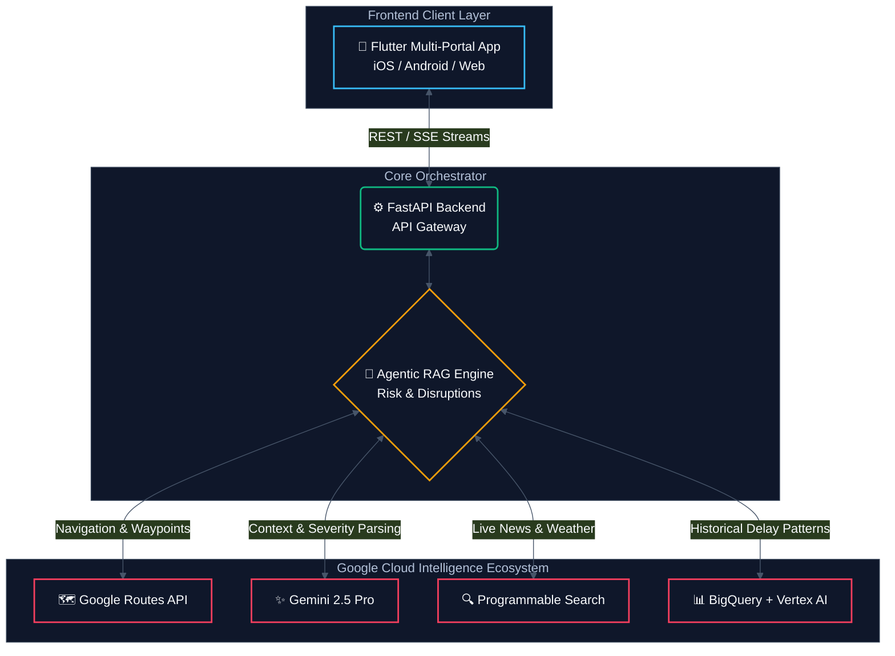
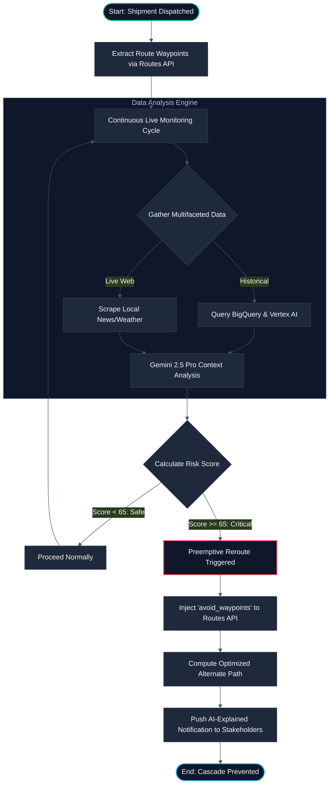
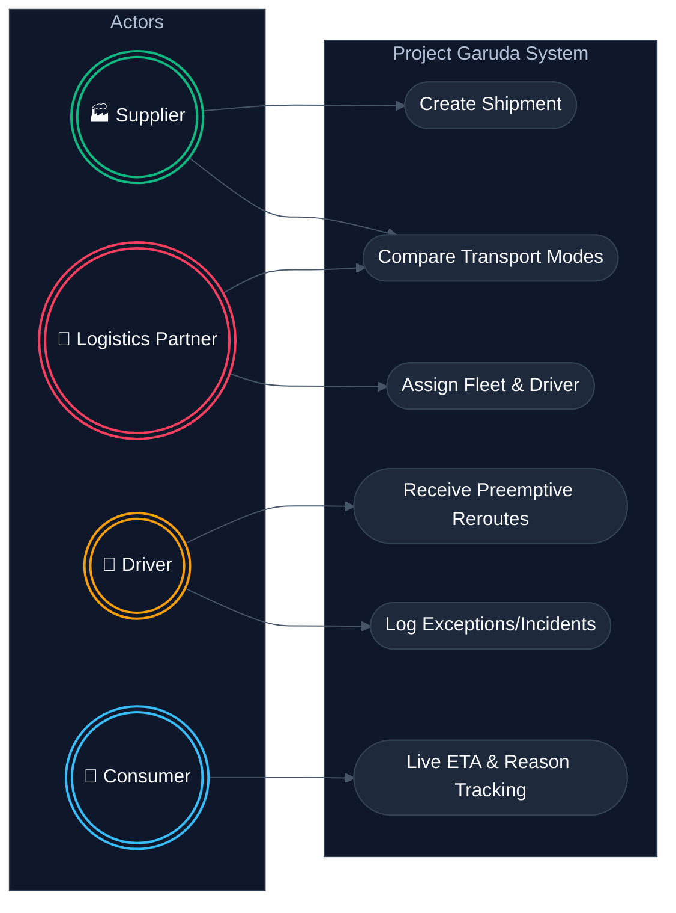

<div align="center">
  
  
  # Project Garuda
  **Smart Supply Chains: Resilient Logistics & Dynamic Supply Chain Optimization**

  <p align="center">
    <a href="https://cloud.google.com/"></a>
    <a href="https://flutter.dev/"></a>
    <a href="https://fastapi.tiangolo.com/"></a>
    <a href="https://deepmind.google/technologies/gemini/"></a>
    <a href="LICENSE"></a>
  </p>

  *Built for the **Google Solution Challenge 2026**.*
</div>

---

## 🎯 Problem Statement

**Smart Supply Chains: Resilient Logistics and Dynamic Supply Chain Optimization**

Modern global supply chains manage millions of concurrent shipments across highly complex and inherently volatile transportation networks. Critical transit disruptions ranging from sudden weather events to hidden operational bottlenecks are chronically identified only *after* delivery timelines are already compromised.

### 💡 The Objective
Design a scalable system capable of continuously analyzing multifaceted transit data to preemptively detect and flag potential supply chain disruptions. Formulate dynamic mechanisms that instantly execute or recommend highly optimized route adjustments before localized bottlenecks cascade into broader delays.

---

## 📋 Table of Contents
1. [🎯 Problem Statement & Objective](#-problem-statement)
2. [✈️ Omni-Modal Approach](#-omni-modal-approach)
3. [📊 System Diagrams & Engineering](#-system-diagrams--engineering)
    - [Architecture Diagram](#1-system-architecture)
    - [Process Flow](#2-intelligent-process-flow)
    - [Use Case Diagram](#3-multi-actor-use-cases)
    - [Wireframe & Screen Flow](#4-ui-wireframe--mock-flow)
4. [🌟 Key Features](#-key-features)
5. [🌱 Sustainable Impact (UN SDGs)](#-sustainable-impact-un-sdgs)
6. [🛠️ Tech Stack & Google Cloud Services](#️-tech-stack--google-cloud-services)
7. [🚀 Getting Started](#-getting-started)
8. [📜 License](#-license)

---

## ✈️🚢🚆🚚 Omni-Modal Approach

Project Garuda is built to orchestrate and protect shipments across **all mediums of transport**. It continuously monitors networks and intelligently recommends mode switching when catastrophic disruptions occur.

| Transport Mode | Volatility Monitored | Optimization Strategy |
| :--- | :--- | :--- |
| ✈️ **Flight / Air** | Air traffic control delays, severe weather cells. | Optimal air-corridor routing; preemptive shifting to ground freight. |
| 🚢 **Maritime / Ships** | Port congestion, maritime storms, canal blockages. | ETA adjustment, alternative port docking, dynamic demurrage mitigation. |
| 🚆 **Rail / Freight** | Track maintenance, derailments, signaling failures. | Predictive delay modeling via BigQuery; terminal congestion avoidance. |
| 🚚 **Road / Trucks** | Highway accidents, roadblocks, heavy rain. | Real-time rerouting via Google Routes API using `avoid_waypoints`. |
| 🛵 **Last-Mile / Delivery** | Hyper-local traffic spikes, flooded streets, fatigue. | TSP (Traveling Salesman Problem) multi-stop optimization; micro-routing. |

---

## 📊 System Diagrams & Engineering

### 1. System Architecture
Garuda employs an **Agentic RAG** architecture orchestrated via FastAPI, serving a unified Flutter application suite.



### 2. Intelligent Process Flow
How Garuda continuously analyzes data to preemptively detect disruptions before they escalate.



### 3. Multi-Actor Use Cases
The system is built for the entire logistics ecosystem.



### 4. Full End-to-End System Flow
The complete lifecycle of a shipment across all four roles, driven by API interactions and AI intelligence.

```mermaid
sequenceDiagram
    autonumber
    
    actor Supplier
    actor Logistics
    actor Delivery
    actor Consumer
    participant FlutterApp
    participant FastApiBackend
    participant GeminiAI
    participant GoogleMaps

    %% --------------------------------------------------------
    %% PHASE 1: SUPPLIER - CREATION & PRE-CHECK
    %% --------------------------------------------------------
    rect rgb(30, 40, 60)
        note over Supplier,GoogleMaps: Phase 1: Supplier Creates Shipment
        Supplier->>FlutterApp: Opens Create Shipment
        Supplier->>FlutterApp: Taps "Origin" (Location Picker)
        FlutterApp->>GoogleMaps: Fetch Places (Autocomplete)
        GoogleMaps-->>FlutterApp: "Mumbai, Maharashtra"
        Supplier->>FlutterApp: Confirms Location
        FlutterApp->>FlutterApp: Stores `lat:19.07, lng:72.87`, displays "Mumbai"
        
        Supplier->>FlutterApp: Taps "Pre-flight Check"
        FlutterApp->>FastApiBackend: POST /v1/routes/precheck (lat/lng)
        FastApiBackend->>GeminiAI: Analyze weather, events, congestion
        GeminiAI-->>FastApiBackend: Returns Predicted Risk Score
        FastApiBackend-->>FlutterApp: Shows "Clear for Dispatch" (Score: 25)
        
        Supplier->>FlutterApp: Taps "Create Shipment"
        FlutterApp->>FastApiBackend: POST /v1/shipments/ (origin/dest lat/lng)
        FastApiBackend-->>FlutterApp: Shipment Created (Status: PENDING)
    end

    %% --------------------------------------------------------
    %% PHASE 2: LOGISTICS - DISPATCH & ASSIGNMENT
    %% --------------------------------------------------------
    rect rgb(40, 30, 60)
        note over Logistics,FastApiBackend: Phase 2: Logistics Fleet Assignment
        Logistics->>FlutterApp: Views Logistics Dashboard
        FlutterApp->>FastApiBackend: GET /v1/shipments/user/{uid}?role=LOGISTICS
        FastApiBackend-->>FlutterApp: Returns PENDING shipments
        Logistics->>FlutterApp: Assigns Driver ID to Shipment
        FlutterApp->>FastApiBackend: PATCH /v1/shipments/{id}/assign
        FastApiBackend-->>FlutterApp: Status Updated (Status: ASSIGNED)
    end

    %% --------------------------------------------------------
    %% PHASE 3: DELIVERY - LIVE MONITORING & DRIVING
    %% --------------------------------------------------------
    rect rgb(30, 50, 40)
        note over Delivery,GeminiAI: Phase 3: Delivery Live Ride & Rerouting
        Delivery->>FlutterApp: Opens Active Ride Screen
        Delivery->>FlutterApp: Taps "Start Ride"
        FlutterApp->>FastApiBackend: PATCH /v1/shipments/{id}/status (Status: DISPATCHED)
        
        loop Every 5 Minutes
            FlutterApp->>FastApiBackend: PATCH /v1/shipments/{id}/location (Live GPS Ping)
            FastApiBackend->>FastApiBackend: Updates tracking database
            
            FlutterApp->>FastApiBackend: POST /v1/ride/monitor
            FastApiBackend->>GeminiAI: Scan path ahead for live roadblocks/storms
            alt Path Clear
                GeminiAI-->>FastApiBackend: Severity 0.0
                FastApiBackend-->>FlutterApp: "Path looks clear."
            else Hazard Detected
                GeminiAI-->>FastApiBackend: Severity 0.8 (Accident ahead)
                FastApiBackend-->>FlutterApp: "REROUTE_SUGGESTED!"
                FlutterApp->>Delivery: Displays Warning Overlay & Alternate Route
            end
        end
        Delivery->>FlutterApp: Arrives at destination, taps "Complete"
        FlutterApp->>FastApiBackend: PATCH status to DELIVERED
    end

    %% --------------------------------------------------------
    %% PHASE 4: CONSUMER - LIVE TRACKING & EXPLANATIONS
    %% --------------------------------------------------------
    rect rgb(60, 40, 30)
        note over Consumer,GeminiAI: Phase 4: Consumer Live Tracking
        Consumer->>FlutterApp: Enters Tracking ID
        FlutterApp->>FastApiBackend: GET /v1/shipments/{id}
        FastApiBackend-->>FlutterApp: Returns status, live location, and integrity score
        
        Consumer->>FlutterApp: Taps "Why is this delayed?" (Explainable AI)
        FlutterApp->>FastApiBackend: GET /v1/shipments/{id}/risk-details
        FastApiBackend->>GeminiAI: Request detailed breakdown of risk factors
        GeminiAI-->>FastApiBackend: "Rain causing 15 min delay"
        FastApiBackend-->>FlutterApp: Displays AI Risk Explanation to Consumer
    end
```



### 5. UI Wireframe & Mock Flow
Logical layout of the Omnichannel Flutter portals.

```mermaid
%%{init: {"theme": "base", "themeVariables": {"primaryColor": "#1E293B", "primaryTextColor": "#F8FAFC", "primaryBorderColor": "#334155", "lineColor": "#475569"}}}%%
block-beta
    columns 4
    
    block:Auth:4
        Title("🔒 Unified Authentication Gate")
        Desc("Role-Based Access Control (Supplier, Logistics, Driver, Consumer)")
    end

    space:4

    block:Supplier:1
        S_Title("🏭 Supplier Portal")
        S_Btn1("➕ New Shipment")
        S_Btn2("⚖️ Compare Modes")
        S_Btn3("📊 Cost Analytics")
    end

    block:Logistics:1
        L_Title("🏢 Logistics Admin")
        L_Btn1("🗺️ Fleet Heatmap")
        L_Btn2("🚦 Active Alerts")
        L_Btn3("👨‍✈️ Driver Assignment")
    end

    block:Driver:1
        D_Title("🚚 Driver App")
        D_Btn1("📍 Live Navigation")
        D_Btn2("🚨 AI Reroute Prompts")
        D_Btn3("🚧 Report Incident")
    end

    block:Consumer:1
        C_Title("👤 Consumer App")
        C_Btn1("📦 Live Tracking")
        C_Btn2("⏱️ Dynamic ETA")
        C_Btn3("💬 Secure Chat")
    end
    
    style Auth fill:#0F172A,stroke:#38BDF8,stroke-width:2px,color:#F8FAFC
    style Supplier fill:#0F172A,stroke:#10B981,stroke-width:2px,color:#F8FAFC
    style Logistics fill:#0F172A,stroke:#F43F5E,stroke-width:2px,color:#F8FAFC
    style Driver fill:#0F172A,stroke:#F59E0B,stroke-width:2px,color:#F8FAFC
    style Consumer fill:#0F172A,stroke:#A855F7,stroke-width:2px,color:#F8FAFC
```



---

## 🌟 Key Features

*   **Preemptive Disruption Detection:** Detects and mitigates bottlenecks 15-30 minutes *before* the shipment reaches the affected zone.
*   **Explainable AI Transparency:** Users aren't blindly rerouted. Gemini generates natural language explanations: *"Multi-vehicle accident detected 22km ahead. Rerouting via alternate highway to prevent a 45-min delay."*
*   **Intelligent Mode Switching:** If a truck breaks down, Garuda automatically calculates the cost/time/carbon impact of transferring cargo to the nearest rail terminal.
*   **Geofencing & Demand Surge:** AI predicts regional demand surges (festivals, weather events) and alerts fleet managers to preposition assets.
*   **Driver Fatigue Monitoring:** Analyzes drive hours, time-of-day, and distances to mandate breaks, ensuring regulatory compliance and safety.

---

## 🌱 Sustainable Impact (UN SDGs)

Aligned with the Google Solution Challenge goals, Project Garuda directly addresses:
*   **SDG 9 (Industry, Innovation & Infrastructure):** Upgrades legacy logistics into resilient, intelligent networks capable of handling extreme volatility.
*   **SDG 11 (Sustainable Cities & Communities):** Reduces urban congestion by actively routing commercial fleets away from traffic hotspots.
*   **SDG 13 (Climate Action):** Significantly reduces carbon emissions. By eliminating idle time in undetected traffic blocks, models show up to a **13.6% reduction in fuel consumption**.

---

## 🛠️ The Google Ecosystem Advantage

Project Garuda is deeply integrated with Google's premier developer tools and cloud infrastructure to ensure global scalability, real-time synchronization, and state-of-the-art AI reasoning.

### 🧠 Google AI & Machine Learning
*   **Gemini 2.5 Flash:** Acts as the core reasoning engine. It parses unstructured text (news, weather alerts) to understand context, classify disruption severity, and generate human-readable explanations for reroutes.
*   **Google Vertex AI:** Powers predictive modeling for regional demand surges, localized congestion trends, and predictive delay analysis.

### ☁️ Google Cloud Infrastructure
*   **Google Cloud Run:** Hosts the highly-concurrent FastAPI backend in a serverless, automatically scaling environment to handle unpredictable traffic spikes during supply chain crises.
*   **Google BigQuery:** Provides a massively scalable data warehouse for storing and analyzing years of historical transit and delay patterns to identify recurring bottlenecks.

### 🗺️ Google Maps Platform
*   **Google Routes API:** Delivers precise navigation, multi-stop optimization (TSP), and alternate path generation using the crucial `avoid_waypoints` parameter to seamlessly route around newly detected hazards.

### 🔥 Firebase Platform
*   **Firebase Authentication:** Provides robust, secure, and seamless login experiences across all four user portals.
*   **Cloud Firestore:** Enables blazing-fast, real-time database synchronization. When a truck pings a location update, Firestore instantly pushes that data to the consumer's live tracking map via WebSockets/SSE.

### 📱 Frontend & Presentation
*   **Flutter (Dart):** Powers the unified omnichannel frontend. A single codebase deploys native-feeling applications for Suppliers, Logistics Admins, Drivers, and Consumers across iOS, Android, and Web.
*   **Google Slides:** (Used for the pitch presentation and architectural mockups presented to stakeholders).

### 🔍 Search & Retrieval
*   **Google Programmable Search API:** The live retrieval mechanism for our Agentic RAG pipeline, actively scraping local news, weather alerts, and regulatory changes relevant to the route's current waypoints.

---

## 🚀 Getting Started

### Prerequisites
*   Python 3.11+
*   Flutter SDK 3.11+
*   Google Cloud Project (Billing Enabled) with API Keys for Maps, Search, and Vertex AI.
*   Firebase Project setup.

### Backend Setup
```bash
# 1. Navigate to the backend directory
cd backend-fastapi

# 2. Create and activate a virtual environment
python -m venv venv
source venv/bin/activate  # Windows: venv\Scripts\activate

# 3. Install dependencies
pip install -r requirements.txt

# 4. Configure environment variables (.env)
# PROJECT_ID=your-gcp-id
# GOOGLE_MAPS_KEY=your-maps-key
# FIREBASE_WEB_API_KEY=your-firebase-key

# 5. Run the orchestrator
uvicorn main:app --reload --host 0.0.0.0 --port 8000
```
*API documentation available interactively at `https://garuda-backend-437904093333.asia-south1.run.app/scalar`*

### Frontend Setup
```bash
# 1. Navigate to the Flutter directory
cd flutter_app

# 2. Fetch dependencies
flutter pub get

# 3. Run the application
flutter run
```

---

## 📜 License

This project is licensed under the MIT License - see the [LICENSE](LICENSE) file for details.

<div align="center">
  <i>Built with ❤️ and 🧠 by TechNoSena for the Google Solution Challenge 2026.</i>
</div>
