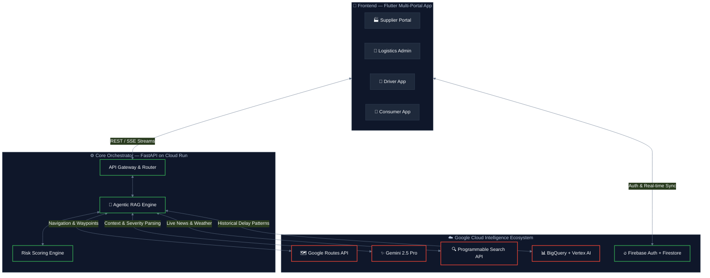
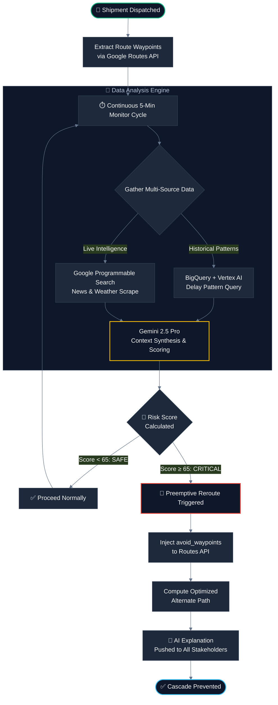
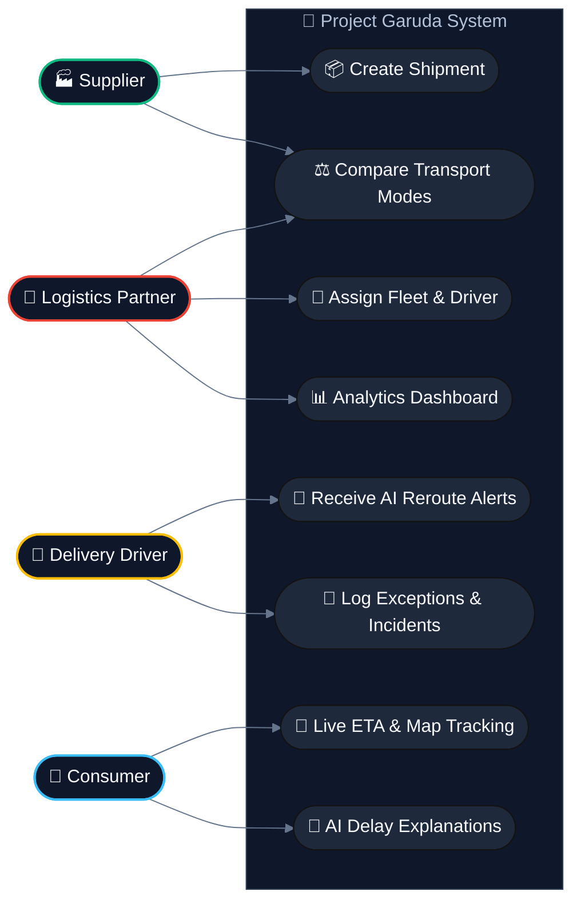
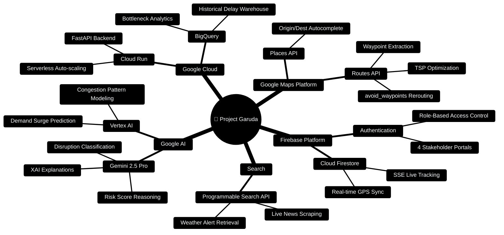
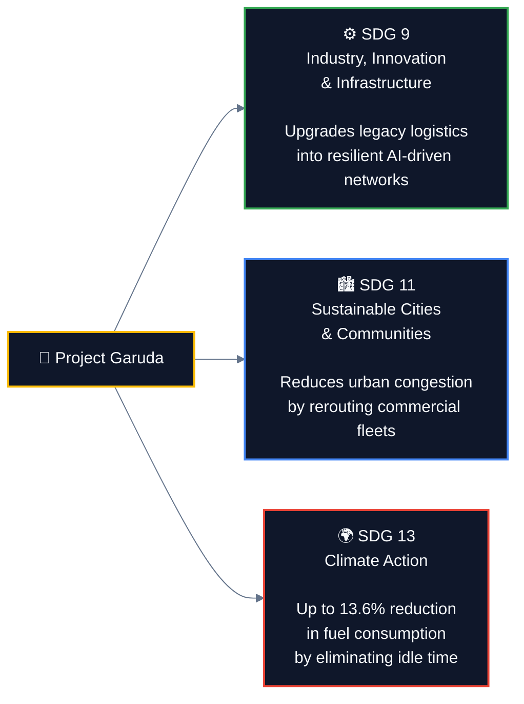

<div align="center">
  

  # 🦅 Project Garuda

  ### *Smart Supply Chains: Resilient Logistics & Dynamic Supply Chain Optimization*

  <p align="center">
    <a href="https://github.com/TechNoSena/Garuda/actions/workflows/build-apk.yml">
      
    </a>
    
    
    
    
    
    
  </p>

  <p align="center">
    <a href="https://github.com/TechNoSena/Garuda/releases/download/beta/Garurda-beta-v1.0.0.apk"><strong>📲 Download APK (Beta v1.0.0)</strong></a>
    &nbsp;·&nbsp;
    <a href="https://garuda-backend-437904093333.asia-south1.run.app/scalar"><strong>📡 Live API Docs</strong></a>
    &nbsp;·&nbsp;
    <a href="https://youtu.be/Alz17zhRqGw"><strong>🎬 Demo Video</strong></a>
    &nbsp;·&nbsp;
    <a href="https://youtu.be/vWFgSMFtTHY"><strong>🖼️ Prototype Walkthrough</strong></a>
  </p>

  <br/>

  > **Built for the Google Solution Challenge 2026** · Theme: *Smart Supply Chains*
  > 
  > *By Team DietCoke*

</div>

---

## 📌 Table of Contents

1. [Problem Statement](#-problem-statement)
2. [Our Solution](#-our-solution)
3. [Live Demo & Downloads](#-live-demo--downloads)
4. [Architecture](#-system-architecture)
5. [Intelligent Process Flow](#-intelligent-process-flow)
6. [Omni-Modal Transport Coverage](#-omni-modal-transport-coverage)
7. [Multi-Actor System (Use Cases)](#-multi-actor-system)
8. [End-to-End Sequence Flow](#-end-to-end-sequence-flow)
9. [Key Features](#-key-features)
10. [Google Ecosystem Integration](#-google-ecosystem-integration)
11. [Sustainable Impact (UN SDGs)](#-sustainable-impact-un-sdgs)
12. [Tech Stack](#-tech-stack)
13. [Getting Started](#-getting-started)
14. [Demo Credentials](#-demo-credentials)
15. [License](#-license)

---

## 🎯 Problem Statement

> **Theme:** Smart Supply Chains
> **Problem:** Resilient Logistics and Dynamic Supply Chain Optimization

Modern global supply chains manage **millions of concurrent shipments** across highly complex and inherently volatile transportation networks. Critical transit disruptions — ranging from sudden weather events to hidden operational bottlenecks — are chronically identified **only after delivery timelines are already compromised**.

### The Objective
Design a scalable system capable of **continuously analyzing multifaceted transit data** to preemptively detect and flag potential supply chain disruptions. Formulate dynamic mechanisms that **instantly execute or recommend highly optimized route adjustments** before localized bottlenecks cascade into broader delays.

---

## 💡 Our Solution

**Project Garuda** is a full-stack, AI-powered supply chain orchestration platform that transforms logistics from *reactive damage control* into *proactive, preemptive resilience*. It continuously fuses live intelligence streams — weather, traffic, news, historical data — and uses **Gemini 2.5 Pro** as a reasoning engine to compute disruption risk scores every 5 minutes per active shipment.

When risk crosses a critical threshold, Garuda **automatically reroutes** the shipment via the Google Routes API — 15 to 30 minutes before the driver reaches the hazard zone — preventing cascade failures before they begin.

The platform serves **four distinct stakeholder roles** (Supplier, Logistics Partner, Delivery Driver, Consumer) through a single unified Flutter application, backed by a scalable FastAPI engine deployed on Google Cloud Run.

| Metric | Impact |
|:---|:---|
| ⛽ Fuel Consumption Reduction | Up to **13.6%** |
| ⏱️ Disruption Detection Lead Time | **15–30 minutes** before impact |
| 🗺️ Transport Modes Covered | **5** (Air, Maritime, Rail, Road, Last-Mile) |
| 👥 Stakeholder Portals | **4** unified in one Flutter app |
| ☁️ Deployment | Google Cloud Run (serverless, auto-scaling) |

---

## 🚀 Live Demo & Downloads

| Resource | Link |
|:---|:---|
| 📲 **Android APK (Beta v1.0.0)** | [Download from GitHub Releases](https://github.com/TechNoSena/Garuda/releases/download/beta/Garurda-beta-v1.0.0.apk) |
| 📡 **Live Backend API Docs** | [Scalar Interactive Docs](https://garuda-backend-437904093333.asia-south1.run.app/scalar) |
| 🎬 **Full Demo Video** | [Watch on YouTube](https://youtu.be/Alz17zhRqGw) |
| 🖼️ **Prototype Walkthrough** | [Watch on YouTube](https://youtu.be/vWFgSMFtTHY) |
| 🏗️ **CI/CD Build Pipeline** | [GitHub Actions](https://github.com/TechNoSena/Garuda/actions/workflows/build-apk.yml) |

---

## 🏗️ System Architecture

Garuda employs an **Agentic RAG (Retrieval-Augmented Generation)** architecture orchestrated by FastAPI, serving a unified Flutter multi-portal application.



---

## 🔄 Intelligent Process Flow

How Garuda continuously analyzes data to **preemptively detect disruptions** before they escalate into delays.



---

## ✈️🚢🚆🚚🛵 Omni-Modal Transport Coverage

Project Garuda is built to orchestrate and protect shipments across **all five mediums of transport**, continuously monitoring for mode-specific volatility and intelligently recommending mode-switching when catastrophic disruptions occur.

| Mode | Volatility Monitored | Garuda's Response |
|:---|:---|:---|
| ✈️ **Air Freight** | Air traffic delays, severe weather cells, airport closures | Optimal air-corridor routing; preemptive shift to ground freight |
| 🚢 **Maritime / Ships** | Port congestion, maritime storms, canal blockages | ETA adjustment, alternate port docking, demurrage mitigation |
| 🚆 **Rail / Freight** | Track maintenance, derailments, signaling failures | Predictive delay modeling via BigQuery; terminal congestion avoidance |
| 🚚 **Road / Trucks** | Highway accidents, roadblocks, severe rain | Real-time rerouting via Routes API `avoid_waypoints` |
| 🛵 **Last-Mile Delivery** | Hyper-local traffic spikes, flooded streets, driver fatigue | TSP multi-stop optimization; AI-driven micro-routing |

---

## 👥 Multi-Actor System

Garuda serves the **entire logistics ecosystem** through a single application with role-based portals.



---

## 🔗 End-to-End Sequence Flow

The complete lifecycle of a shipment across all four roles, driven by real API interactions and AI intelligence.

```mermaid
sequenceDiagram
    autonumber

    actor Supplier
    actor Logistics
    actor Driver
    actor Consumer
    participant App as 📱 Flutter App
    participant API as ⚙️ FastAPI Backend
    participant Gemini as ✨ Gemini 2.5 Pro
    participant Maps as 🗺️ Routes API
    participant DB as 🔥 Firestore

    rect rgb(15, 30, 50)
        note over Supplier,DB: Phase 1 — Supplier Creates & Pre-checks Shipment
        Supplier->>App: Opens Create Shipment
        App->>Maps: Places Autocomplete (Origin/Dest)
        Maps-->>App: Coordinates returned
        Supplier->>App: Taps "Pre-flight Check"
        App->>API: POST /v1/routes/precheck
        API->>Gemini: Analyze weather, events, congestion
        Gemini-->>API: Risk Score: 25 (SAFE)
        API-->>App: "Clear for Dispatch ✅"
        Supplier->>App: Confirms & Creates Shipment
        App->>API: POST /v1/shipments/
        API->>DB: Persist (Status: PENDING)
    end

    rect rgb(30, 15, 50)
        note over Logistics,DB: Phase 2 — Logistics Assigns Fleet
        Logistics->>App: Views Logistics Dashboard
        App->>API: GET /v1/shipments?role=LOGISTICS
        API-->>App: Returns PENDING shipments
        Logistics->>App: Assigns Driver to Shipment
        App->>API: PATCH /v1/shipments/{id}/assign
        API->>DB: Update (Status: ASSIGNED)
    end

    rect rgb(15, 40, 25)
        note over Driver,Gemini: Phase 3 — Live Ride with AI Monitoring
        Driver->>App: Starts Ride
        App->>API: PATCH status → DISPATCHED
        loop Every 5 Minutes
            App->>API: POST /v1/ride/monitor (GPS ping)
            API->>Gemini: Scan route ahead for hazards
            alt Path Clear
                Gemini-->>API: Severity 0.0
                API-->>App: "Path looks clear 🟢"
            else Hazard Detected
                Gemini-->>API: Severity 0.85 — Accident ahead
                API-->>App: REROUTE_SUGGESTED 🔴
                App->>Maps: Compute alternate via avoid_waypoints
                Maps-->>App: Optimized alternate route
                App->>Driver: Display reroute overlay + AI explanation
            end
        end
        Driver->>App: Arrives & taps Complete
        App->>API: PATCH status → DELIVERED
    end

    rect rgb(50, 30, 15)
        note over Consumer,Gemini: Phase 4 — Consumer Live Tracking
        Consumer->>App: Enters Tracking ID
        App->>API: GET /v1/shipments/{id}
        API->>DB: Fetch live location + risk score
        DB-->>App: Status, GPS coords, ETA
        Consumer->>App: Taps "Why is this delayed?"
        App->>API: GET /v1/shipments/{id}/risk-details
        API->>Gemini: Generate plain-language explanation
        Gemini-->>API: "Rain causing 15-min delay on NH-48"
        API-->>App: Display AI explanation to Consumer
    end
```



---

## 🌟 Key Features

### 🧠 Preemptive Disruption Detection
Our Agentic RAG engine runs a continuous 5-minute monitoring cycle per active shipment, fusing historical delay data (BigQuery + Vertex AI) with live intelligence (Google Programmable Search). Gemini 2.5 Pro synthesizes these streams to compute a structured **Risk Score (0–100)** and triggers rerouting **15–30 minutes before** the shipment reaches the hazard zone — preventing cascades before they begin.

### 💬 Explainable AI (XAI) Transparency
Stakeholders are never blindly redirected. Gemini generates natural-language explanations for every action:
> *"Multi-vehicle accident detected 22km ahead on NH-48. Rerouting via SH-4 saves an estimated 45 minutes and avoids cascade delay."*

### ⚖️ Intelligent Mode Switching
If a truck is blocked, Garuda instantly calculates the **cost / time / carbon trade-off** of switching cargo to the nearest rail terminal or air freight hub, providing logistics managers a data-driven decision matrix.

### 📍 Real-Time Fleet Visibility
Live GPS pings every 5 minutes flow through FastAPI into **Cloud Firestore**, which pushes location updates via SSE/WebSocket to the consumer's live tracking map with sub-second latency.

### 🏎️ Last-Mile TSP Optimization
Garuda solves the **Travelling Salesman Problem** for multi-stop delivery routes, minimizing total distance and ensuring optimized drop-off sequencing for urban last-mile drivers.

### 🚧 Driver Fatigue & Incident Monitoring
Garuda analyzes drive hours, time-of-day, and distance thresholds to flag fatigue risks and mandate regulatory breaks, with drivers able to log on-road incidents directly from the app.

### 🌍 Demand Surge Geofencing
AI predicts regional demand spikes driven by festivals, weather events, and market trends, alerting fleet managers to **preposition assets** before surge windows open.

---

## ☁️ Google Ecosystem Integration

Project Garuda is deeply embedded in the **Google for Developers** ecosystem, leveraging premier cloud infrastructure, AI, and mapping services.



| Google Service | Role in Garuda |
|:---|:---|
| **Gemini 2.5 Pro** | Core AI reasoning — risk scoring, XAI explanations, disruption severity parsing |
| **Vertex AI** | Predictive modeling — demand surges, congestion trends |
| **Google Routes API** | Waypoint extraction, alternate path computation, `avoid_waypoints` rerouting, TSP |
| **Google Places API** | Origin/destination autocomplete in the shipment creation flow |
| **BigQuery** | Historical delay pattern warehouse for ML training and bottleneck analysis |
| **Google Cloud Run** | Serverless, auto-scaling FastAPI backend — handles traffic spikes during crises |
| **Firebase Auth** | Secure role-based login across all 4 user portals |
| **Cloud Firestore** | Real-time GPS synchronization; SSE streams for live consumer tracking map |
| **Programmable Search API** | RAG retrieval layer — live scraping of news, weather, and regulatory alerts |

---

## 🌱 Sustainable Impact (UN SDGs)

Project Garuda directly addresses three UN Sustainable Development Goals, aligned with the Google Solution Challenge's mission.



---

## 🛠️ Tech Stack

| Layer | Technology |
|:---|:---|
| **Mobile / Frontend** | Flutter (Dart) — iOS, Android, Web |
| **Backend API** | Python FastAPI — deployed on Google Cloud Run |
| **AI Reasoning** | Gemini 2.5 Pro (via Vertex AI SDK) |
| **Predictive ML** | Google Vertex AI + BigQuery ML |
| **Navigation** | Google Routes API + Google Places API |
| **Live Retrieval (RAG)** | Google Programmable Search Engine API |
| **Database** | Google Cloud Firestore (real-time) |
| **Authentication** | Firebase Authentication |
| **CI/CD** | GitHub Actions (automated APK build) |

---

## 🚀 Getting Started

### Prerequisites
- Python 3.11+
- Flutter SDK 3.11+
- Google Cloud Project (Billing Enabled)
- API Keys: Google Maps, Programmable Search, Vertex AI
- Firebase Project configured

### Backend Setup

```bash
# 1. Navigate to the backend directory
cd backend-fastapi

# 2. Create and activate virtual environment
python -m venv venv
source venv/bin/activate        # Windows: venv\Scripts\activate

# 3. Install dependencies
pip install -r requirements.txt

# 4. Configure environment variables
cp .env.example .env
# Fill in: PROJECT_ID, GOOGLE_MAPS_KEY, FIREBASE_WEB_API_KEY, GEMINI_API_KEY

# 5. Run the server
uvicorn main:app --reload --host 0.0.0.0 --port 8000
```

> 📡 **Interactive API Docs (Live):** [https://garuda-backend-437904093333.asia-south1.run.app/scalar](https://garuda-backend-437904093333.asia-south1.run.app/scalar)

### Flutter App Setup

```bash
# 1. Navigate to the Flutter directory
cd flutter_app

# 2. Install dependencies
flutter pub get

# 3. Run the application
flutter run

# Or download the pre-built APK directly:
# https://github.com/TechNoSena/Garuda/releases/download/beta/Garurda-beta-v1.0.0.apk
```

---

## 🔑 Demo Credentials

Test the full platform end-to-end using these pre-configured demo accounts. Each account unlocks a different role-specific portal.

| Role | Portal | Email | Password |
|:---|:---|:---|:---|
| 🏭 **Supplier** | Create shipments, pre-flight risk checks, mode comparison | `demos@gmail.com` | `demo1234` |
| 🏢 **Logistics Partner** | Fleet management, driver assignment, active alerts heatmap | `demolp@gmail.com` | `demo1234` |
| 🚚 **Delivery Driver** | Live navigation, AI reroute prompts, incident reporting | `demodm@gmail.com` | `demo1234` |
| 👤 **Consumer** | Live shipment tracking, dynamic ETA, AI delay explanations | `democ@gmail.com` | `demo1234` |

> **Tip:** Use the Supplier account to create a shipment, then log in as Logistics Partner to assign the Driver account, and finally track it as the Consumer — for the full end-to-end experience.

---

## 📄 License

This project is licensed under the **MIT License** — see the [LICENSE](LICENSE) file for details.

---

<div align="center">

  

  **Project Garuda** · Google Solution Challenge 2026

  *Built with ❤️ and ☁️ by **Team DietCoke***

  [](https://github.com/TechNoSena/Garuda/actions/workflows/build-apk.yml)

</div>
