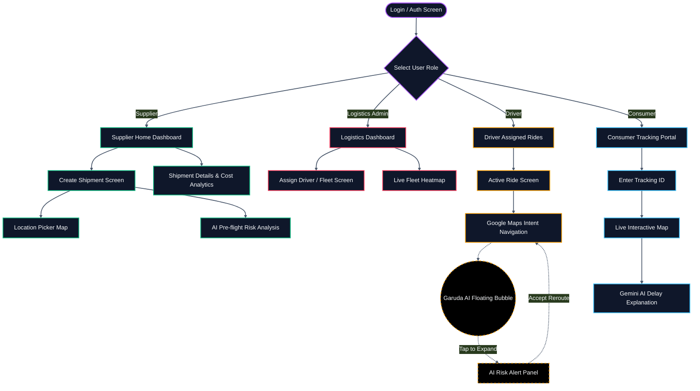

# Garuda App Wireframe

Copy and paste the following Mermaid code into [Mermaid Live Editor](https://mermaid.live/) or any Markdown viewer that supports Mermaid (like GitHub) to see the visual flow of the application screens.

